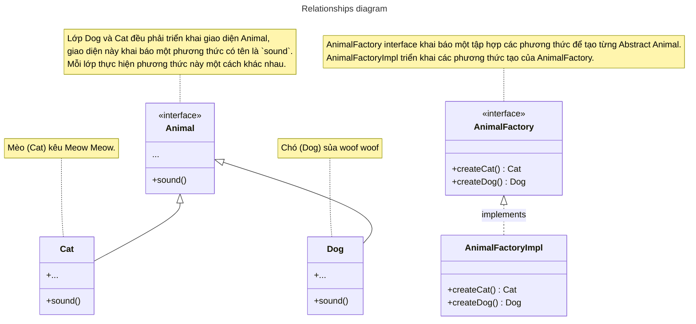

# Abstract Factory Pattern

## Abstract Factory Pattern là gì?

Abstract Factory là một mẫu thiết kế phép bạn tạo ra các nhóm đối tượng liên quan mà không cần chỉ định các lớp cụ thể của chúng.

## Ứng dụng
- Sử dụng Abstract Factory khi mã của bạn cần hoạt động với nhiều lớp liên quan khác nhau, nhưng bạn không muốn 
nó phụ thuộc vào các lớp cụ thể đó - chúng có thể chưa được biết trước hoặc bạn chỉ muốn cho phép **khả năng mở rộng** trong tương lai.

## Sơ đồ minh hoạ



## Code triển khai

### Example in Dart

```dart title="Abstract Factory Method example in Dart"
abstract class Animal {
  void sound() {}
}

class Cat implements Animal {
  @override
  void sound() {
    print('😺 Cat call Meow Meow Meow');
  }
}

class Dog implements Animal {
  @override
  void sound() {
    print('🐶 Dog call Woof woof woof');
  }
}

/// Implement Abstract Factory  
///
abstract class AnimalFactory {
  Cat createCat();
  Dog createDog();
}

class AnimalFactoryImpl implements AnimalFactory {
  @override
  Cat createCat() => Cat();

  @override
  Dog createDog() => Dog();
}

void main(List<String> args) {
  final AnimalFactory animalFactory = AnimalFactoryImpl();
  final Animal dog = animalFactory.createDog();
  final Animal cat = animalFactory.createCat();

  assert(cat is Cat);
  cat.sound(); // 😺 Cat call Meow Meow Meow

  assert(dog is Dog);
  dog.sound(); // 🐶 Dog call Woof woof woof
}
```

### Example in Flutter

Đoạn mã dưới đây sẽ mở rộng [ví dụ trước đó](../design-pattern/factory_method_pattern.mdx#example-in-flutter) của *Pactory Method Pattern* theo Abstract Factory Method.

```dart title="Abstract Factory Method example in Flutter"
import 'package:flutter/cupertino.dart';
import 'package:flutter/material.dart';

abstract class PlatformFilledButton {
  // ...
}

class MaterialFilledButton implements PlatformFilledButton {
  // ...
}

class CupertinoFilledButton implements PlatformFilledButton {
  /// ...
}

abstract class PlatformSwitch {
  factory PlatformSwitch(TargetPlatform platform) {
    return switch (platform) {
      TargetPlatform.android ||
      TargetPlatform.fuchsia ||
      TargetPlatform.linux ||
      TargetPlatform.windows =>
        MaterialSwitch(),
      TargetPlatform.iOS || TargetPlatform.macOS => MyCupertinoSwitch(),
    };
  }

  Widget build(
    BuildContext context, {
    required bool value,
    required ValueChanged<bool> onChanged,
  });
}

class MaterialSwitch implements PlatformSwitch {
  @override
  Widget build(
    BuildContext context, {
    required bool value,
    required ValueChanged<bool> onChanged,
  }) {
    return Switch(
      value: value,
      onChanged: onChanged,
    );
  }
}

class MyCupertinoSwitch implements PlatformSwitch {
  @override
  Widget build(
    BuildContext context, {
    required bool value,
    required ValueChanged<bool> onChanged,
  }) {
    return CupertinoSwitch(
      value: value,
      onChanged: onChanged,
    );
  }
}

/// Implement Abstract Factory Method
///
class PlatformWidget {
  static Widget buildFilledButton(
    BuildContext context, {
    required Widget child,
    required VoidCallback onPressed,
  }) {
    return PlatformFilledButton(Theme.of(context).platform).build(
      context,
      child: child,
      onPressed: onPressed,
    );
  }

  static Widget buildSwitch(
    BuildContext context, {
    required bool value,
    required ValueChanged<bool> onChanged,
  }) {
    return PlatformSwitch(Theme.of(context).platform).build(
      context,
      value: value,
      onChanged: onChanged,
    );
  }
}

void main(List<String> args) {
  runApp(const MyAppScreen());
}

class MyAppScreen extends StatefulWidget {
  const MyAppScreen({super.key});

  @override
  State<MyAppScreen> createState() => _MyAppScreenState();
}

class _MyAppScreenState extends State<MyAppScreen> {
  bool _value = true;

  @override
  Widget build(BuildContext context) {
    return MaterialApp(
      home: Scaffold(
        body: Center(
          child: PlatformWidget.buildSwitch(
            context,
            value: _value,
            onChanged: (value) {
              setState(() {
                _value = value;
              });
            },
          ),
        ),
      ),
    );
  }
}
```

Qua ví dụ này, chúng ta có thể thấy Abstract Factory Method pattern có một số ưu điểm so với Factory Method pattern,
cho phép viết client code rõ ràng mà không cần biết subclass của platform nào sẽ được tạo.

## Tài liệu tham khảo

- https://refactoring.guru/design-patterns/abstract-factory
- https://anonystick.com/blog-developer/phan-2-factory-pattern-cach-ma-toi-trien-khai-trong-nha-may-vinfast-fresher-va-junior-nen-bo-qua-phan-3-2020110554662242