# Factory Method Pattern

> Còn được gọi là *Virtual Constructor*.

## Factory Method là gì?

Factory Method là một mẫu thiết kế cho chúng ta định nghĩa được nhiều đối tượng và cho phép các lớp con tự quyết định 
là cái nào được khởi tạo, giúp che giấu logic tạo của đối tượng khỏi mã máy khách.

## Sơ đồ minh hoạ

```mermaid
---
title: Relationships diagram
---
classDiagram
  note "Lớp Dog và Cat đều phải triển khai giao diện Animal, giao diện này khai báo một phương thức có tên là `sound`.
        Mỗi lớp thực hiện phương thức này một cách khác nhau: Chó (Dog) sủa woof woof, Mèo (Cat) kêu Meow Meow."
  class Animal
    <<interface>> Animal
    Animal <|-- Cat
    Animal <|-- Dog
    Animal : ...
    Animal: +sound()
  class Dog{
    +...
    +sound()
  }
  class Cat{
    +...
    +sound()
  }
```



## Code triển khai

### Factory Method example

```dart title="Factory Method example"
abstract class Animal {
  factory Animal(AnimalSpecies species) {
    return switch (species) {
      AnimalSpecies.cat => Cat(),
      AnimalSpecies.dog => Dog(),
    };
  }
  void sound() {}
}

class Cat implements Animal {
  @override
  void sound() {
    print('😺 Cat call Meow Meow Meow');
  }
}

class Dog implements Animal {
  @override
  void sound() {
    print('🐶 Dog call Woof woof woof');
  }
}

enum AnimalSpecies {
  dog,
  cat,
}

void main(List<String> args) {
  final Animal cat = Animal(AnimalSpecies.cat);
  final Animal dog = Animal(AnimalSpecies.dog);

  assert(cat is Cat);
  cat.sound(); // 😺 Cat call Meow Meow Meow

  assert(dog is Dog);
  dog.sound(); // 🐶 Dog call Woof woof woof
}
```

### Factory Method example in Flutter {#factory-method-example-in-flutter}

Trong ví dụ này, Factory Method được sử dụng để tạo một FilledButton hiển thị theo nền tảng. 

:::info

Đây chỉ là ví dụ về cách triển khai Factory Method, trong thực tế tôi sẽ dùng cách khác ngắn hơn với trường hợp này.

:::

```dart title="Factory Method example in Flutter"
import 'package:flutter/cupertino.dart';
import 'package:flutter/material.dart';

abstract class PlatformFilledButton {
  factory PlatformFilledButton(TargetPlatform platform) {
    return switch (platform) {
      TargetPlatform.android ||
      TargetPlatform.fuchsia ||
      TargetPlatform.linux ||
      TargetPlatform.windows =>
        MaterialFilledButton(),
      TargetPlatform.iOS || TargetPlatform.macOS => CupertinoFilledButton(),
    };
  }

  Widget build(
    BuildContext context, {
    required Widget child,
    required VoidCallback onPressed,
  });
}

class MaterialFilledButton implements PlatformFilledButton {
  @override
  Widget build(
    BuildContext context, {
    required Widget child,
    required VoidCallback onPressed,
  }) {
    return FilledButton(
      onPressed: onPressed,
      child: child,
    );
  }
}

class CupertinoFilledButton implements PlatformFilledButton {
  @override
  Widget build(
    BuildContext context, {
    required Widget child,
    required VoidCallback onPressed,
  }) {
    return CupertinoButton.filled(
      onPressed: onPressed,
      child: child,
    );
  }
}

void main(List<String> args) {
  runApp(const MyAppScreen());
}

class MyAppScreen extends StatelessWidget {
  const MyAppScreen({super.key});

  @override
  Widget build(BuildContext context) {
    return MaterialApp(
      home: Scaffold(
        body: Center(
          child: PlatformFilledButton(Theme.of(context).platform).build(
            context,
            onPressed: () {
              debugPrint('Button pressed!');
            },
            child: const Text('Click me!'),
          ),
        ),
      ),
    );
  }
}
```

## Abstract Factory Method pattern
> Mở rộng của Factory Method

Đoạn mã dưới đây sẽ mở rộng [ví dụ trước đó](#factory-method-example-in-flutter) theo Abstract Factory Method.

```dart title="Abstract Factory Method example in Flutter"
import 'package:flutter/cupertino.dart';
import 'package:flutter/material.dart';

abstract class PlatformFilledButton {
  // ...
}

class MaterialFilledButton implements PlatformFilledButton {
  // ...
}

class CupertinoFilledButton implements PlatformFilledButton {
  /// ...
}

abstract class PlatformSwitch {
  factory PlatformSwitch(TargetPlatform platform) {
    return switch (platform) {
      TargetPlatform.android ||
      TargetPlatform.fuchsia ||
      TargetPlatform.linux ||
      TargetPlatform.windows =>
        MaterialSwitch(),
      TargetPlatform.iOS || TargetPlatform.macOS => MyCupertinoSwitch(),
    };
  }

  Widget build(
    BuildContext context, {
    required bool value,
    required ValueChanged<bool> onChanged,
  });
}

class MaterialSwitch implements PlatformSwitch {
  @override
  Widget build(
    BuildContext context, {
    required bool value,
    required ValueChanged<bool> onChanged,
  }) {
    return Switch(
      value: value,
      onChanged: onChanged,
    );
  }
}

class MyCupertinoSwitch implements PlatformSwitch {
  @override
  Widget build(
    BuildContext context, {
    required bool value,
    required ValueChanged<bool> onChanged,
  }) {
    return CupertinoSwitch(
      value: value,
      onChanged: onChanged,
    );
  }
}

/// Implement Abstract Factory Method
///
class PlatformWidget {
  static Widget buildFilledButton(
    BuildContext context, {
    required Widget child,
    required VoidCallback onPressed,
  }) {
    return PlatformFilledButton(Theme.of(context).platform).build(
      context,
      child: child,
      onPressed: onPressed,
    );
  }

  static Widget buildSwitch(
    BuildContext context, {
    required bool value,
    required ValueChanged<bool> onChanged,
  }) {
    return PlatformSwitch(Theme.of(context).platform).build(
      context,
      value: value,
      onChanged: onChanged,
    );
  }
}

void main(List<String> args) {
  runApp(const MyAppScreen());
}

class MyAppScreen extends StatefulWidget {
  const MyAppScreen({super.key});

  @override
  State<MyAppScreen> createState() => _MyAppScreenState();
}

class _MyAppScreenState extends State<MyAppScreen> {
  bool _value = true;

  @override
  Widget build(BuildContext context) {
    return MaterialApp(
      home: Scaffold(
        body: Center(
          child: PlatformWidget.buildSwitch(
            context,
            value: _value,
            onChanged: (value) {
              setState(() {
                _value = value;
              });
            },
          ),
        ),
      ),
    );
  }
}
```

Qua ví dụ này, chúng ta có thể thấy Abstract Factory Method pattern có một số ưu điểm so với Factory Method pattern,
cho phép viết client code rõ ràng mà không cần biết subclass của platform nào sẽ được tạo.

## Tài liệu tham khảo
- https://refactoring.guru/design-patterns/factory-method
- https://dart.academy/creational-design-patterns-for-dart-and-flutter-factory-method/