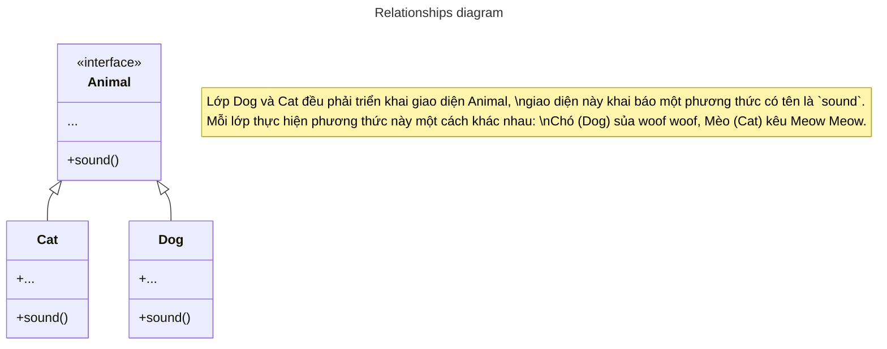

# Factory Method Pattern

> Còn được gọi là *Virtual Constructor*.

## Factory Method là gì?

Factory Method là một mẫu thiết kế cho chúng ta định nghĩa được nhiều đối tượng và cho phép các lớp con tự quyết định 
là cái nào được khởi tạo, giúp che giấu logic tạo của đối tượng khỏi client code.

## Sơ đồ minh hoạ



## Code triển khai

### Example in Dart

```dart title="Factory Method Pattern example in Dart"
abstract class Animal {
  factory Animal(AnimalSpecies species) {
    return switch (species) {
      AnimalSpecies.cat => Cat(),
      AnimalSpecies.dog => Dog(),
    };
  }
  void sound() {}
}

class Cat implements Animal {
  @override
  void sound() {
    print('😺 Cat call Meow Meow Meow');
  }
}

class Dog implements Animal {
  @override
  void sound() {
    print('🐶 Dog call Woof woof woof');
  }
}

enum AnimalSpecies {
  dog,
  cat,
}

void main(List<String> args) {
  final Animal cat = Animal(AnimalSpecies.cat);
  final Animal dog = Animal(AnimalSpecies.dog);

  assert(cat is Cat);
  cat.sound(); // 😺 Cat call Meow Meow Meow

  assert(dog is Dog);
  dog.sound(); // 🐶 Dog call Woof woof woof
}
```

### Example in Flutter {#example-in-flutter}

Trong ví dụ này, Factory Method được sử dụng để tạo một FilledButton hiển thị theo nền tảng. 

:::info

Đây chỉ là ví dụ về cách triển khai Factory Method, trong thực tế tôi sẽ dùng cách khác ngắn hơn với trường hợp này.

:::

```dart title="Factory Method Pattern example in Flutter"
import 'package:flutter/cupertino.dart';
import 'package:flutter/material.dart';

abstract class PlatformFilledButton {
  factory PlatformFilledButton(TargetPlatform platform) {
    return switch (platform) {
      TargetPlatform.android ||
      TargetPlatform.fuchsia ||
      TargetPlatform.linux ||
      TargetPlatform.windows =>
        MaterialFilledButton(),
      TargetPlatform.iOS || TargetPlatform.macOS => CupertinoFilledButton(),
    };
  }

  Widget build(
    BuildContext context, {
    required Widget child,
    required VoidCallback onPressed,
  });
}

class MaterialFilledButton implements PlatformFilledButton {
  @override
  Widget build(
    BuildContext context, {
    required Widget child,
    required VoidCallback onPressed,
  }) {
    return FilledButton(
      onPressed: onPressed,
      child: child,
    );
  }
}

class CupertinoFilledButton implements PlatformFilledButton {
  @override
  Widget build(
    BuildContext context, {
    required Widget child,
    required VoidCallback onPressed,
  }) {
    return CupertinoButton.filled(
      onPressed: onPressed,
      child: child,
    );
  }
}

void main(List<String> args) {
  runApp(const MyAppScreen());
}

class MyAppScreen extends StatelessWidget {
  const MyAppScreen({super.key});

  @override
  Widget build(BuildContext context) {
    return MaterialApp(
      home: Scaffold(
        body: Center(
          child: PlatformFilledButton(Theme.of(context).platform).build(
            context,
            onPressed: () {
              debugPrint('Button pressed!');
            },
            child: const Text('Click me!'),
          ),
        ),
      ),
    );
  }
}
```

## Tài liệu tham khảo
- https://refactoring.guru/design-patterns/factory-method
- https://dart.academy/creational-design-patterns-for-dart-and-flutter-factory-method/